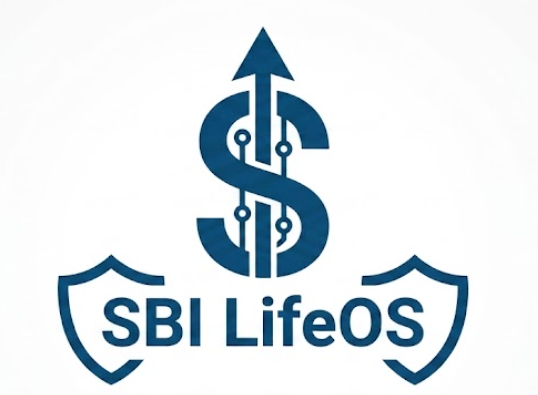
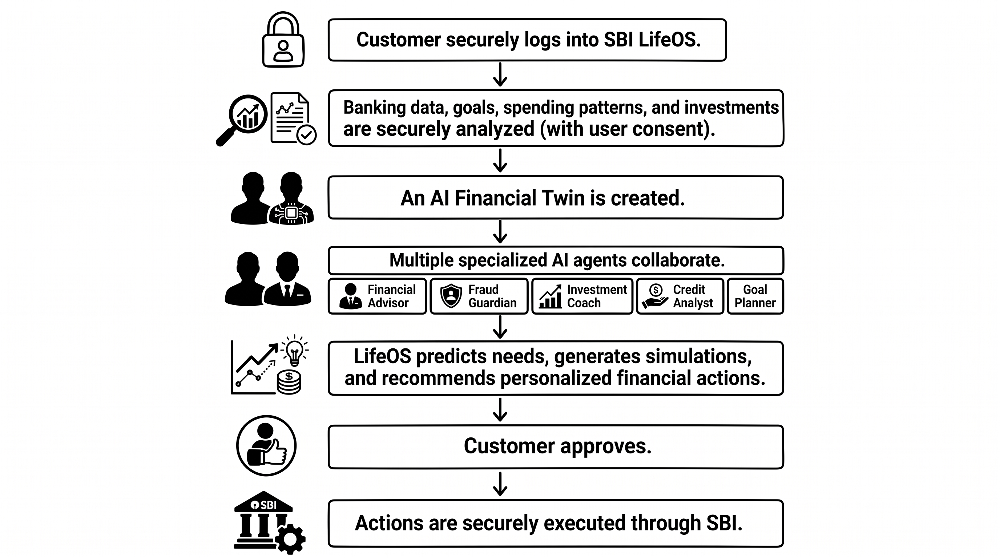

# 🚀 SBI LifeOS

### *The World's First Autonomous Financial Operating System*

#### **Don't just bank. Let your money think, plan, protect, and grow for you.**

---

---

### 🏆 SBI Hackathon @ GFF 2026 Submission

Building the future of intelligent, autonomous banking through Agentic AI.

---

# 🌍 Vision

SBI LifeOS is an AI-powered financial operating system that transforms traditional banking into an intelligent, proactive financial ecosystem.

Instead of waiting for customers to search for loans, investments, insurance, or savings options, LifeOS proactively understands financial behavior, predicts future needs, prevents fraud, and guides customers toward smarter financial decisions.

Every customer receives a secure **AI Financial Twin** that continuously learns, adapts, and evolves with their financial journey.

# ✨ Key Features

- 🤖 **AI Financial Twin** – A living digital model that understands each customer's financial behavior and goals.
- 🧠 **Multi-Agent AI System** – Specialized AI agents collaborate to deliver intelligent financial assistance.
- 📊 **Future Financial Simulation** – Simulate the financial impact of major life decisions before making them.
- 💰 **Smart Budget Optimization** – Personalized budgeting and expense analysis.
- 📈 **Investment & Wealth Advisor** – AI-powered investment recommendations aligned with risk profile.
- 🏦 **Personalized SBI Product Recommendations** – Intelligent suggestions for loans, cards, insurance, and deposits.
- 🛡️ **Predictive Fraud Detection** – Identifies suspicious activities and proactively alerts users.
- 🎯 **Goal-Based Financial Planning** – Plan for education, travel, home, marriage, and retirement.
- 🌐 **Voice & Multilingual Banking** – Natural conversations in multiple Indian languages.
- 🔒 **Explainable & Responsible AI** – Transparent recommendations with privacy and security at the core.

---

# 🏗️ System Architecture

  

The architecture leverages a **Multi-Agent AI ecosystem** where specialized agents collaborate through an orchestration layer to deliver personalized, secure, and autonomous financial services. The system integrates Google Gemini, Vertex AI, SBI APIs, and cloud-native services to provide scalable, explainable, and real-time banking intelligence.

---

# ⚙️ How It Works

  

1. Customer securely signs in using SBI authentication.
2. Financial data is securely aggregated with user consent.
3. An AI Financial Twin is continuously updated.
4. Specialized AI agents analyze spending, investments, goals, loans, and fraud risks.
5. The orchestration engine generates personalized recommendations and simulations.
6. Customers interact using natural language through voice or chat.
7. Upon approval, banking actions are securely executed through SBI infrastructure.
8. The AI continuously learns to deliver increasingly personalized experiences.

---

# 🤖 AI Agents

| AI Agent | Responsibility |
|-----------|----------------|
| 💼 Financial Advisor | Creates personalized financial plans and wealth strategies. |
| 🛡️ Fraud Guardian | Detects suspicious activities and protects users from fraud. |
| 📈 Investment Coach | Recommends investments based on goals and risk profile. |
| 🏦 Credit Analyst | Evaluates loan eligibility and optimizes EMIs. |
| 🎯 Goal Planner | Helps customers plan for education, travel, home, marriage, and retirement. |
| 🏥 Insurance Advisor | Suggests personalized insurance coverage. |
| 🎼 Orchestrator Agent | Coordinates all AI agents to deliver a unified experience. |

---

# 🛠️ Technology Stack

| Category | Technologies |
|----------|--------------|
| **Frontend** | Angular, Flutter |
| **Backend** | Python (FastAPI), Node.js |
| **Artificial Intelligence** | Google Gemini, Vertex AI, LangGraph, Agent Development Kit (ADK) |
| **Cloud Platform** | Google Cloud Platform, Cloud Run, Cloud Functions, BigQuery, Cloud Storage |
| **Databases** | PostgreSQL, Firestore, Vector Database |
| **Security** | OAuth 2.0, JWT, Multi-Factor Authentication, End-to-End Encryption |
| **DevOps** | Docker, Kubernetes, GitHub Actions |
| **Integration APIs** | SBI APIs, UPI APIs, Account Aggregator Framework |

---

# 💼 Business Impact

## 👤 Customer Benefits

- Personalized financial guidance
- AI-powered financial planning
- Smart investment recommendations
- Goal-based wealth creation
- Proactive fraud protection
- Natural voice & multilingual banking

## 🏦 SBI Benefits

- Increased digital engagement
- Higher customer retention
- Intelligent cross-selling
- Reduced operational costs
- Improved fraud prevention
- Hyper-personalized banking
- Increased revenue through AI-driven recommendations

---

# 🚀 Future Roadmap

- AI Wealth Manager
- Autonomous Investment Engine
- Smart Tax Advisor
- Family Financial Planning
- AI Retirement Planner
- Voice-First Banking
- Hyper-Personalized Banking
- RBI-Compliant Responsible AI
- Autonomous Banking Ecosystem

---

# 📄 Project Documentation

📑 **Idea Deck:**  
👉 [SBI LifeOS Submission](docs/SBI%20LifeOS_Suchitra22.pdf)

---

# 👨‍💻 Team

**Team Name:** *(Your Team Name)*

- Suchitra Satapathy
- Team Member 2
- Team Member 3
- Team Member 4

---

# 🌟 The Future of Banking Starts Here

> **"Banking shouldn't wait for customers to ask. It should anticipate, protect, and empower every financial decision."**

### ⭐ If you like this project, don't forget to star this repository!

